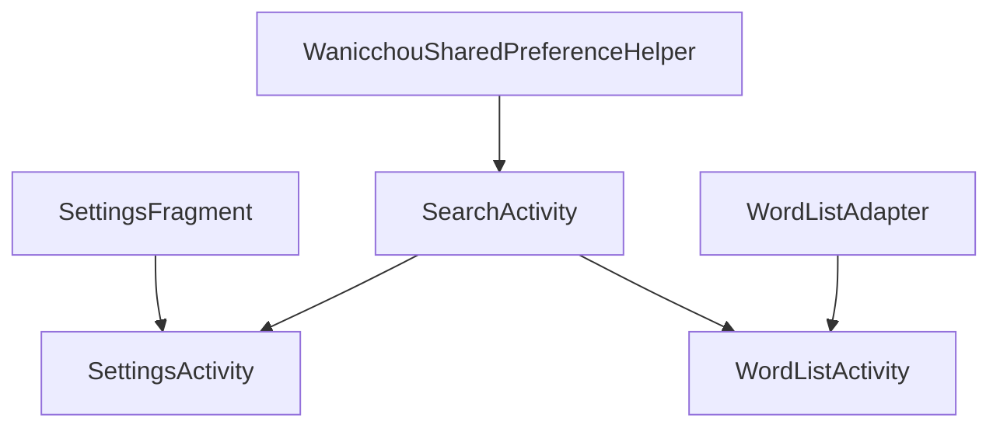
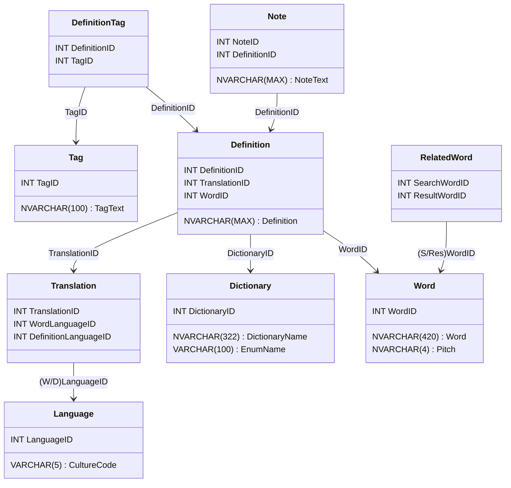

```mermaid
graph TD;
    SearchActivity --> SettingsActivity;
    WordListAdapter --> WordListActivity;
    SearchActivity --> WordListActivity;
    SettingsFragment --> SettingsActivity;
    WanicchouSharedPreferenceHelper --> SearchActivity;
```

# DB Diagram

```mermaid
classDiagram
Translation --> Language : (W/D)LanguageID
DefinitionTag --> Tag : TagID

Definition --> Dictionary : DictionaryID
Definition --> Word : WordID
RelatedWord --> Word : (S/Res)WordID
DefinitionTag --> Definition : DefinitionID

Definition --> Translation : TranslationID

Note --> Definition : DefinitionID

Note : INT NoteID
Note : INT DefinitionID
Note : NVARCHAR(MAX) NoteText

Tag : INT TagID
Tag : NVARCHAR(100) TagText

DefinitionTag : INT DefinitionID
DefinitionTag : INT TagID

Translation : INT TranslationID
Translation : INT WordLanguageID
Translation : INT DefinitionLanguageID


Dictionary : INT DictionaryID
Dictionary : NVARCHAR(322) DictionaryName
Dictionary : VARCHAR(100) EnumName

RelatedWord : INT SearchWordID
RelatedWord : INT ResultWordID

Definition : NVARCHAR(MAX) Definition
Definition : INT DefinitionID
Definition : INT TranslationID
Definition : INT WordID

Word : INT WordID
Word : NVARCHAR(420) Word
Word : NVARCHAR(4) Pitch

Language : INT LanguageID
Language : VARCHAR(5) CultureCode
```
