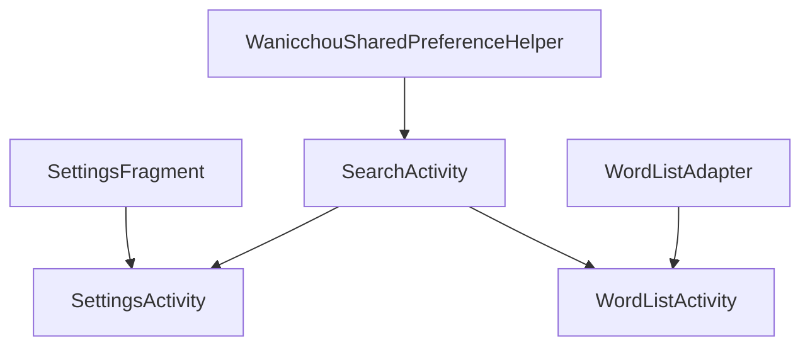
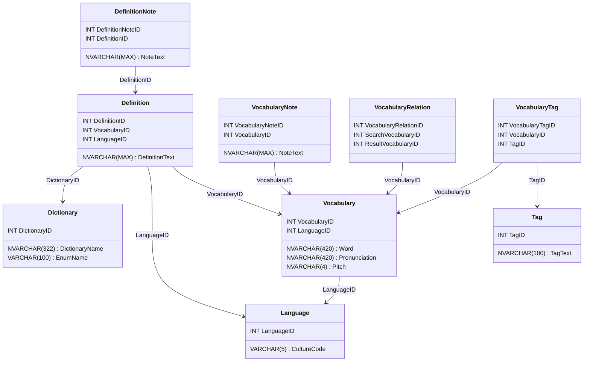

```mermaid
graph TD;
    SearchActivity --> SettingsActivity;
    WordListAdapter --> WordListActivity;
    SearchActivity --> WordListActivity;
    SettingsFragment --> SettingsActivity;
    WanicchouSharedPreferenceHelper --> SearchActivity;
```

# DB Diagram

```mermaid
classDiagram
Definition --> Dictionary : DictionaryID
Definition --> Language : LanguageID
Definition --> Vocabulary : VocabularyID
Vocabulary --> Language : LanguageID

DefinitionNote --> Definition : DefinitionID
VocabularyNote --> Vocabulary : VocabularyID


VocabularyRelation --> Vocabulary : VocabularyID
VocabularyTag --> Vocabulary : VocabularyID

VocabularyTag --> Tag : TagID


DefinitionNote : INT DefinitionNoteID
DefinitionNote : INT DefinitionID
DefinitionNote : NVARCHAR(MAX) NoteText

VocabularyNote : INT VocabularyNoteID
VocabularyNote : INT VocabularyID
VocabularyNote : NVARCHAR(MAX) NoteText

Tag : INT TagID
Tag : NVARCHAR(100) TagText

VocabularyTag : INT VocabularyTagID
VocabularyTag : INT VocabularyID
VocabularyTag : INT TagID


Dictionary : INT DictionaryID
Dictionary : NVARCHAR(322) DictionaryName
Dictionary : VARCHAR(100) EnumName

VocabularyRelation : INT VocabularyRelationID
VocabularyRelation : INT SearchVocabularyID
VocabularyRelation : INT ResultVocabularyID

Definition : NVARCHAR(MAX) DefinitionText
Definition : INT DefinitionID
Definition : INT VocabularyID
Definition : INT LanguageID

Vocabulary : INT VocabularyID
Vocabulary : NVARCHAR(420) Word
Vocabulary : NVARCHAR(420) Pronunciation
Vocabulary : NVARCHAR(4) Pitch
Vocabulary : INT LanguageID

Language : INT LanguageID
Language : VARCHAR(5) CultureCode
```
> Note: VocabularyRelationID and VocabularyTagID can be used for sorting later
