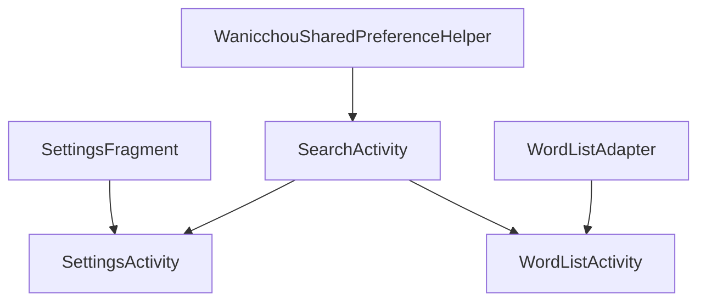
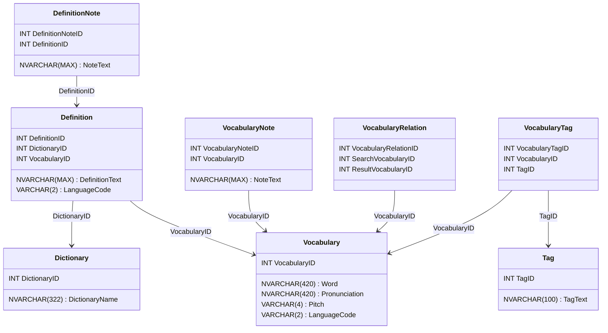

```mermaid
graph TD;
    SearchActivity --> |Request| SearchViewModel;
    SearchViewModel --> || VocabularyRepository
```
Get Vocabulary
Display the first result
From Vocabulary, grab the definition of it from the repo
    There can be multiple definitions per word LiveData<List<List<Definition>>>
        List<Definition> is per word, the outer list corresponds to the word
        Foreach word in LiveData<Vocabulary>, get List<Definition>

Maybe I don't need the whole Vocabulary? this could be potentially expensive.
Should test whether it's more time expensive to get List<Vocabulary> 
    or to get the all the relevant IDs and then display the only selected, querying for it after

# DB Diagram

> Note: VocabularyRelationID and VocabularyTagID can be used for sorting later

> Drag right to assign the different options?
    Dictionary, MatchType, Language
    Populate Dictionary/Lang from DB ideally
